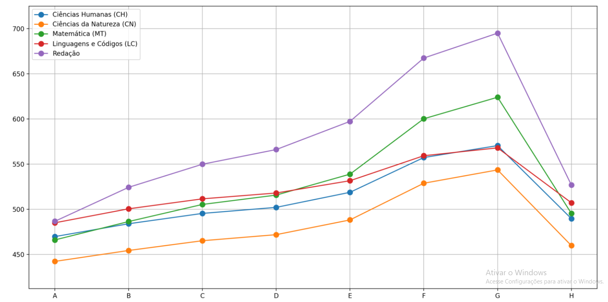
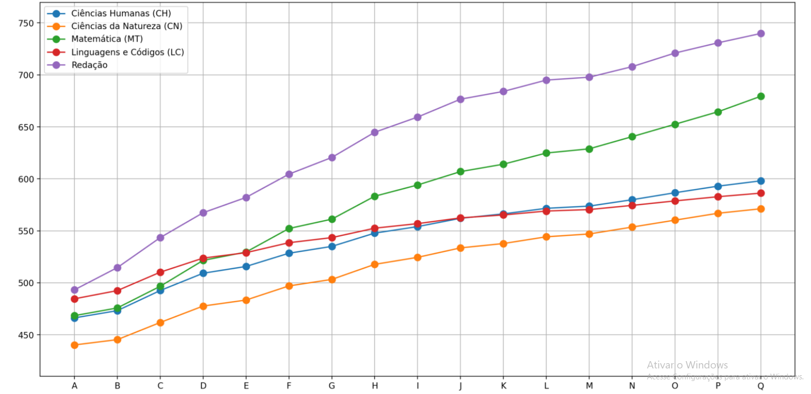

# Projeto do processo seletivo da Liga de IA - Arthur Teles, Guilherme Ferreira, Thiago Ramon

## Observações:
    1. Para executar o projeto abrir o terminal e colocar o seguinte trecho, streamlit run main.py
    2. Verificar se as bibliotecas matplolib e streamlit estão instaladas

## Resultados:

### Distribuição Etária:
    
### Proporção de candidatos por gênero:
    
## Escolas Públicas e Particulares no Enem de 2019
    
### Média das Notas do Enem de 2019
    
### Nível de Escolaridade dos Pais - Pai
    
### Nível de Escolaridade dos Pais - Mãe
    
### Renda Familiar
    
### Escolaridade x Notas - Pai
    A: Nunca estudou.
    B: Não completou a 4ª série/5º ano do Ensino Fundamental.
    C: Completou a 4ª série/5º ano, mas não completou a 8ª série/9º ano do Ensino Fundamental.
    D: Completou a 8ª série/9º ano do Ensino Fundamental, mas não completou o Ensino Médio.
    E: Completou o Ensino Médio, mas não completou a Faculdade.
    F: Completou a Faculdade, mas não completou a Pós-graduação.
    G: Completou a Pós-graduação.
    H: Não sei.
    
### Escolaridade x Notas - Pai
    A: Nunca estudou.
    B: Não completou a 4ª série/5º ano do Ensino Fundamental.
    C: Completou a 4ª série/5º ano, mas não completou a 8ª série/9º ano do Ensino Fundamental.
    D: Completou a 8ª série/9º ano do Ensino Fundamental, mas não completou o Ensino Médio.
    E: Completou o Ensino Médio, mas não completou a Faculdade.
    F: Completou a Faculdade, mas não completou a Pós-graduação.
    G: Completou a Pós-graduação.
    H: Não sei.
    
### Renda Familiar x Notas
    A: Nenhuma renda.
    B: Até 998,00.
    C: De 998,01 - 1.497,00.
    D: De 1.497,01 - 1.996,00.
    E: De 1.996,01 - 2.495,00.
    F: De 2.495,01 - 2.994,00.
    G: De 2.994,01 - 3.992,00.
    H: De 3.992,01 - 4.990,00.
    I: De 4.990,01 - 5.988,00.
    J: De 5.988,01 - 6.986,00.
    K: De 6.986,01 - 7.984,00.
    L: De 7.984,01 - 8.982,00.
    M: De 8.982,01 - 9.980,00.
    N: De 9.980,01 - 11.976,00.
    O: De 11.976,01 - 14.970,00.
    P: De 14.970,01 - 19.960,00.
    Q: Mais de 19.960,00.
    
