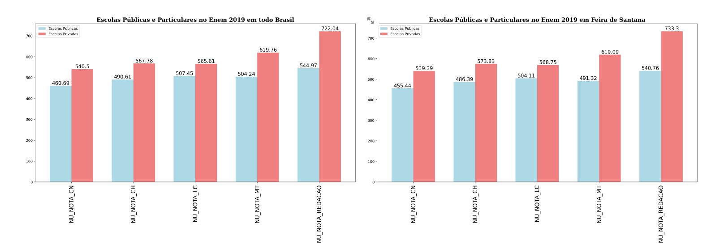
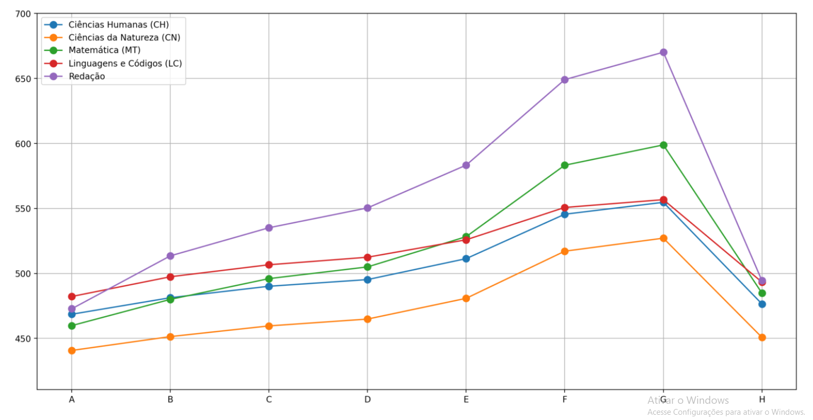

# Projeto do processo seletivo da Liga de IA - Arthur Teles, Guilherme Ferreira, Thiago Ramon

## Observações:
1. Para executar o projeto abrir o terminal e colocar o seguinte trecho, streamlit run main.py
2. Verificar se as bibliotecas matplotlib e streamlit estão instaladas

## Resultados:

### Distribuição Etária:

### Proporção de candidatos por gênero:

## Escolas Públicas e Particulares no Enem de 2019

### Média das Notas do Enem de 2019

### Nível de Escolaridade dos Pais - Pai

### Nível de Escolaridade dos Pais - Mãe

### Renda Familiar

### Escolaridade x Notas - Pai

A: Nunca estudou.

B: Não completou a 4ª série/5º ano do Ensino Fundamental.

C: Completou a 4ª série/5º ano, mas não completou a 8ª série/9º ano do Ensino Fundamental.

D: Completou a 8ª série/9º ano do Ensino Fundamental, mas não completou o Ensino Médio.

E: Completou o Ensino Médio, mas não completou a Faculdade.

F: Completou a Faculdade, mas não completou a Pós-graduação.

G: Completou a Pós-graduação.

H: Não sei.

### Escolaridade x Notas - Mãe

A: Nunca estudou.

B: Não completou a 4ª série/5º ano do Ensino Fundamental.

C: Completou a 4ª série/5º ano, mas não completou a 8ª série/9º ano do Ensino Fundamental.

D: Completou a 8ª série/9º ano do Ensino Fundamental, mas não completou o Ensino Médio.

E: Completou o Ensino Médio, mas não completou a Faculdade.

F: Completou a Faculdade, mas não completou a Pós-graduação.

G: Completou a Pós-graduação.

H: Não sei.

### Renda Familiar x Notas

A: Nenhuma renda.

B: Até 998,00.

C: De 998,01 - 1.497,00.

D: De 1.497,01 - 1.996,00.

E: De 1.996,01 - 2.495,00.

F: De 2.495,01 - 2.994,00.

G: De 2.994,01 - 3.992,00.

H: De 3.992,01 - 4.990,00.

I: De 4.990,01 - 5.988,00.

J: De 5.988,01 - 6.986,00.

K: De 6.986,01 - 7.984,00.

L: De 7.984,01 - 8.982,00.

M: De 8.982,01 - 9.980,00.

N: De 9.980,01 - 11.976,00.

O: De 11.976,01 - 14.970,00.

P: De 14.970,01 - 19.960,00.

Q: Mais de 19.960,00.

